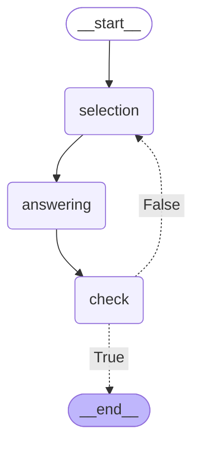

# ai_chat_with_lang_graph

学習目的で、LangGraphを利用した&Q＆Aアプリを作成。

参考書籍: [LangChainとLangGraphによるRAG・AIエージェント［実践］入門](https://amzn.to/3DvNhSi) 

### グラフ構造のビジュアライズ
マーメイド記法での出力
```python
print(compiled.get_graph().draw_mermaid())
```

